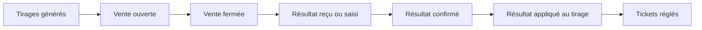

# Jobs de tirage

Cette page résume ce qui se passe automatiquement autour des tirages. Elle n'est
pas un glossaire : elle décrit le cycle opérationnel que les testeurs doivent
observer. Les heures sont des repères de validation : l'heure exacte peut varier
selon le provider, le fuseau du tirage et la configuration du santral.

## Vue d'ensemble

## Cycle normal

| Moment | Ce qui se passe | Ce que le testeur doit voir |
|---|---|---|
| Tous les jours vers 05:00 UTC | Les tirages à venir sont générés pour les canaux actifs. | Les administrateurs voient des tirages prévus pour les prochains jours. |
| Avant l'heure de vente | Le tirage reste planifié. | Le POS ne doit pas vendre si la vente n'est pas encore ouverte. |
| À l'ouverture configurée | Le tirage devient ouvert. | Le POS affiche le tirage vendable. |
| À l'heure limite de vente | Le tirage devient fermé. | Le POS refuse les nouvelles ventes sur ce tirage. |
| Après le tirage officiel | Le système cherche le résultat chez le provider ou attend une saisie manuelle. | Le résultat peut être absent, provisoire ou à corriger pendant une période courte. |
| Après confirmation | Le résultat confirmé est appliqué au tirage. | Le tirage affiche un résultat final lisible. |
| Après application | Les tickets du tirage sont réglés. | Les tickets deviennent gagnants ou perdants selon le résultat. |

## Fenêtres de résultats automatiques

Les résultats externes sont cherchés surtout dans les fenêtres suivantes,
exprimées en heure de New York :

| Fenêtre | Usage |
|---|---|
| 12:00 à 14:00 | Résultats de mi-journée et premières confirmations. |
| 20:00 à 23:00 | Résultats du soir et confirmations tardives. |

Si un provider publie plus tard que d'habitude, Tchalanet peut garder le résultat
absent ou provisoire jusqu'à ce qu'une source exploitable soit disponible.

## Fenêtres de règlement

Le règlement des tickets passe après la confirmation du résultat. Les fenêtres
usuelles, en heure de New York, sont :

| Fenêtre | Usage |
|---|---|
| 12:00 à 15:00 | Règlement des tirages de mi-journée. |
| 20:00 à 23:30 | Règlement des tirages du soir. |

Un résultat provisoire ne doit pas déclencher le règlement final. Si un résultat
est incomplet, incohérent ou corrigé manuellement, le statut visible doit rester
compréhensible pour l'administrateur et le super administrateur.

## Repères support

| Étape | Nom technique visible en support | Rôle |
|---|---|---|
| Génération | `draw:lifecycle:generate` | Prépare les tirages à venir. |
| Ouverture | `draw:lifecycle:open` | Ouvre les tirages vendables. |
| Fermeture | `draw:lifecycle:close` | Ferme les ventes à l'heure limite. |
| Recherche résultat | `results:external:fetch` | Interroge les providers automatiques. |
| Application résultat | `results:external:apply` | Lie un résultat confirmé au tirage. |
| Règlement | `draw:lifecycle:settle` | Calcule les tickets gagnants et perdants. |

## Quand signaler un problème

Signalez un problème si :

- un tirage reste invisible alors qu'il devrait être ouvert ;
- le POS permet de vendre après l'heure limite ;
- un résultat confirmé ne s'applique pas au tirage ;
- un résultat provisoire déclenche un règlement final ;
- un ticket reste sans statut longtemps après le règlement attendu ;
- le statut affiché n'est pas cohérent entre tirage, résultat et ticket.

Dans le signalement, indiquez toujours le santral, le provider, le tirage,
l'heure observée, le fuseau horaire affiché, le statut attendu et le statut
obtenu.
