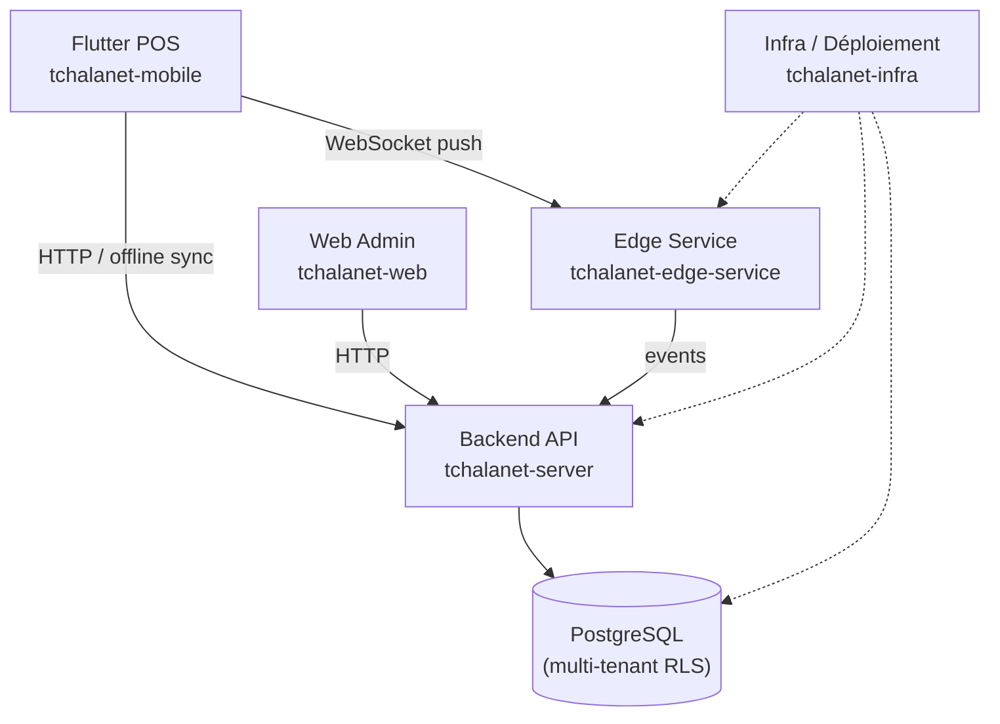

# Carte système

## Ce que cette page répond

Quels sont les projets qui composent Tchalanet et comment s'articulent-ils ?

---

## Vue d'ensemble

---

## Les projets

| Projet | Rôle | Docs |
|---|---|---|
| `tchalanet-server` | Backend Spring Boot — domaines, API REST, RLS | [Architecture backend](../01-architecture/backend-map.md) |
| `tchalanet-web` | Interface admin Angular — back-office tenant/super-admin | [Frontend map](../01-architecture/frontend-map.md) |
| `tchalanet-mobile` | POS Flutter — vente ticket, payout, offline | [Frontend map](../01-architecture/frontend-map.md) |
| `tchalanet-edge-service` | Service de push WebSocket — notifications temps réel | [Infra map](../01-architecture/infra-map.md) |
| `tchalanet-infra` | Infrastructure Hetzner, déploiement, setup | [Infra map](../01-architecture/infra-map.md) |
| `tchalanet-docs` | Ce portail MkDocs | — |

---

## Isolation multi-tenant

Chaque tenant est isolé via PostgreSQL Row-Level Security (RLS). Le contexte opérationnel (tenant, outlet, terminal) est résolu à chaque requête.

Voir [Modèle de sécurité](../01-architecture/security-model.md).

---

## Flows principaux

Les flows métier traversent plusieurs composants :

- **Vente ticket** : POS → Backend → DB → Events → Settlement
- **Tirage** : Backend scheduler → Résultats externes → Draw domain → Events
- **Payout** : POS → Backend → Payout domain → Settlement domain
- **Sync offline** : POS stocke local → sync dès connexion retrouvée

Voir [Flows métier](../02-functional/flows/index.md).

---

## Liens canoniques

- [Backend architecture](../01-architecture/backend-map.md)
- [Frontend / Mobile / Edge](../01-architecture/frontend-map.md)
- [Infra](../01-architecture/infra-map.md)
- [Modèle de sécurité](../01-architecture/security-model.md)
