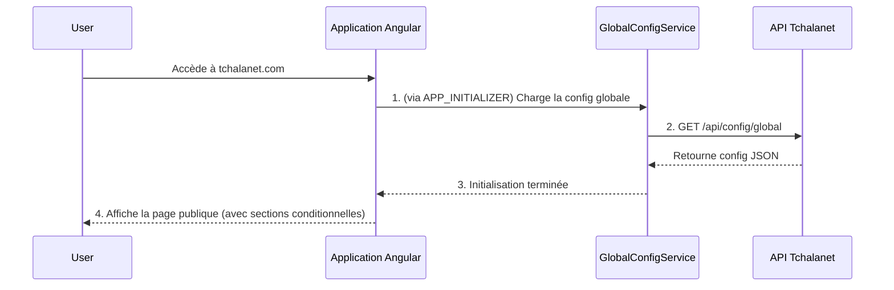
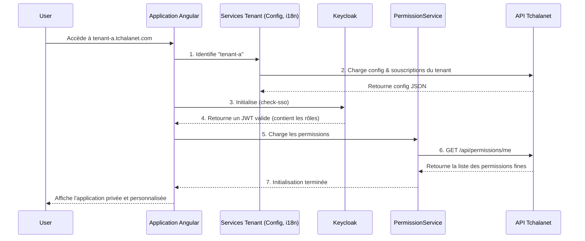

# Documentation Technique de Référence : Architecture Frontend

**Objectif** : Définir l'architecture de référence pour l'application frontend Tchalanet. Cette architecture est conçue pour être évolutive, sécurisée, multi-tenant, et pilotée par la configuration.

## 1. Principes Architecturaux Clés

- **Config-Driven UI** : L'interface est dynamiquement construite à partir de configurations JSON.
    - **Configuration Globale** : Une configuration unique, chargée au démarrage, contrôle l'affichage des sections de la page d'accueil publique.
    - **Configuration par Tenant** : Une configuration spécifique à chaque tenant (chargée après identification) contrôle le layout, le thème et les fonctionnalités de l'espace privé.
- **Tenant-First** : L'identification du tenant (via sous-domaine) est une étape prioritaire de l'initialisation de l'espace privé.
- **Permissions Fines (RBAC)** : L'affichage des fonctionnalités est contrôlé par un `PermissionService` qui vérifie la souscription du tenant, le rôle de l'utilisateur (via Keycloak), et les permissions fines accordées par l'admin du tenant.
- **i18n à Plusieurs Niveaux** : Le système de traduction (`ngx-translate`) fusionne les traductions de base avec les surcharges spécifiques au tenant.

## 2. Stack UI Recommandée

Pour garantir la cohérence, la performance et la maintenabilité, la stack UI suivante est adoptée :

- **CSS Framework** : **Tailwind CSS**. L'approche "utility-first" sera utilisée pour tous les styles.
- **Librairie de Composants** : **DaisyUI**. Utilisée pour les composants UI de base (boutons, formulaires, cards, etc.), car elle est bâtie sur Tailwind.
- **Composants Complexes** : Des librairies "headless" (comme **TanStack Table** pour les tables de données) seront privilégiées pour la logique métier, tandis que leur apparence sera entièrement gérée avec Tailwind/DaisyUI.

*Note : L'utilisation de librairies basées sur Angular Material (comme ng-matero) est proscrite pour éviter les conflits de style et la duplication des systèmes de theming.*

## 3. Schémas d'Architecture

### Schéma 1 : Flux d'Initialisation de la Page Publique

### Schéma 2 : Flux d'Initialisation de l'Espace Privé (Utilisateur Connecté)

## 4. Conception Détaillée

### 4.1. Page d'Accueil Publique

- **`GlobalConfigService`** : Un service, initialisé via `APP_INITIALIZER`, est responsable de l'unique appel `GET /api/config/global`. Il stocke la configuration dans un `Signal` ou un `BehaviorSubject` pour un accès réactif.
- **`HomePublicComponent`** : Ce composant injecte `GlobalConfigService`. Son template HTML utilise des `*ngIf` pour afficher ou masquer les composants enfants (`HeroSectionComponent`, `FeaturesSectionComponent`, etc.) en fonction de la configuration chargée.
- **Contenu** : Tous les textes sont gérés par `ngx-translate` avec des fichiers JSON locaux (`/assets/i18n/*.json`).

### 4.2. Espace Privé

- **`TenantService` & `TenantConfigService`** : Identifient le tenant et chargent sa configuration spécifique (thème, layout de la homepage privée, langues, souscriptions).
- **`PermissionService`** : Le service central pour la logique d'autorisation. Il expose une méthode `hasPermission(permission: string, subscription?: string): boolean` qui sera utilisée dans toute l'application (via des `*ngIf` ou des `Guards`).
- **Architecture de Rendu Dynamique** : La page d'accueil privée utilise un `HomeContainerComponent` qui lit la configuration du layout du tenant et rend dynamiquement une série de "widgets" (`app-widget-*`), chacun vérifiant ses propres permissions avant de s'afficher.
