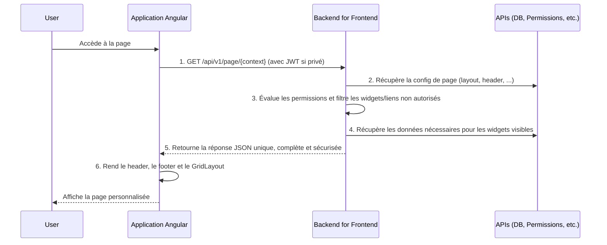

# Documentation Technique de Référence : Architecture Frontend

**Objectif** : Définir une architecture évolutive, sécurisée, et pilotée par la configuration, tout en maîtrisant la complexité.

## 1. Principes Architecturaux Clés

- **Backend for Frontend (BFF)** : Un service de façade qui simplifie le frontend en agrégeant les données, en appliquant les permissions et en centralisant la logique de configuration.
- **Config-Driven UI** : L'interface est construite à partir d'une configuration JSON qui décrit le layout, le thème et les composants, permettant une personnalisation sans redéploiement.
- **Tenant-First & RBAC** : L'identité du tenant et les permissions de l'utilisateur sont les piliers de la sécurité et du filtrage des données, appliqués par le BFF.

## 2. Stack UI

- **Librairie de Composants** : **Angular Material**.
- **Thème et Layout du Dashboard** : **NG-Matero**.
- **Styles Spécifiques** : SCSS classique.

## 3. Structure de la Donnée de Page (Réponse du BFF)

Le BFF retourne un objet JSON unique par page, décrivant son apparence et son contenu.

```json
{
  "context": "dashboard-private",
  "theme": { ... },
  "header": { ... },
  "footer": { ... },
  "layout": { ... }, // Décrit le contenu principal de la page
  "i18n": { ... },
  "issues": [ ... ]
}
```

### 3.1. Le Moteur de Layout : Une Grille Structurée

Pour permettre la flexibilité sans créer le chaos, le contenu de la page est défini par un objet `layout` qui représente une grille hiérarchique. C'est le cœur de la personnalisation.

```json
"layout": {
  "component": "GridLayout",
  "rows": [
    {
      "columns": [
        {
          "span": 8,
          "widgets": [ { "component": "MainChartWidget", ... } ]
        },
        {
          "span": 4,
          "widgets": [ { "component": "LotteryWidget", ... } ]
        }
      ]
    }
  ]
}
```

- **`rows`**: Un tableau de lignes qui structurent la page verticalement.
- **`columns`**: Chaque ligne contient une ou plusieurs colonnes.
- **`span`**: La largeur de la colonne, basée sur une grille de 12, assurant un comportement responsive.
- **`widgets`**: Un tableau des composants à afficher dans une colonne.

### 3.2. Le Widget : Un Composant Encapsulé

Un widget est l'unité de base du contenu. Il est toujours choisi dans un catalogue prédéfini.

```json
{
  "component": "LotteryWidget", // Nom du composant Angular
  "properties": { // Configuration spécifique au widget
    "title": "Prochains tirages",
    "limit": 3
  }
}
```

## 4. Garde-fous Contre "L'Usine à Gaz"

Pour que ce système reste maintenable, les principes suivants doivent être respectés :

1.  **Contrainte de la Grille** : Toute mise en page est contrainte par le système de `rows` et `columns`. Le positionnement libre est interdit.

2.  **Catalogue de Widgets Fini** : Les administrateurs choisissent des widgets dans un catalogue prédéfini et validé. Ils ne peuvent pas créer de composants ni injecter de logique.

3.  **Configuration Strictement Typée** : La structure du JSON de configuration est non-négociable. Elle est validée par un **JSON Schema** côté backend et par des **interfaces TypeScript** côté frontend.

4.  **Personnalisation Encadrée** : La personnalisation affecte principalement les `properties` des widgets et la structure du `layout`. Les éléments globaux (coquille de l'application, header/footer) offrent des options de configuration limitées (ex: modifier les liens) pour préserver une expérience utilisateur cohérente.

5.  **Templates par Défaut** : La création de page doit partir de templates de layout pré-configurés pour guider l'administrateur et éviter les erreurs.

## 5. Schémas d'Architecture (avec BFF)

### Flux d'Initialisation (Page Publique ou Privée)


