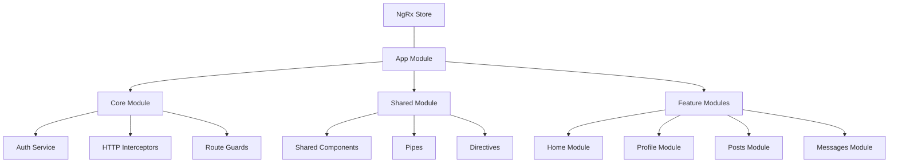
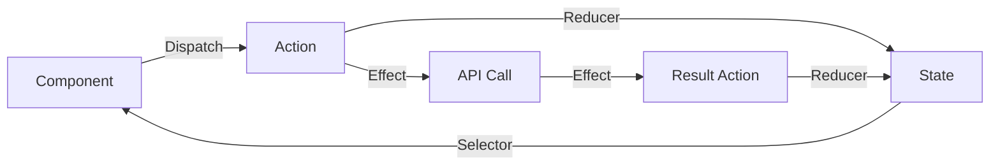

<llm-snippet-file>tchalanet-docs/docs/web/architecture.md</llm-snippet-file>
```markdown
# Architecture Web

Cette page détaille l'architecture de l'application web Tchalanet, construite avec Angular et Nx.

## Vue d'ensemble



## Monorepo Nx
Tchalanet Web est structuré en monorepo avec Nx, ce qui permet de :
- Organiser le code en applications et bibliothèques partageables
- Optimiser les builds avec mise en cache intelligente
- Faciliter la réutilisation de code
- Appliquer des contraintes de dépendances

### Structure du projet
``` 
tchalanet-web/
├── apps/
│   ├── web/              # Application principale
│   │   ├── src/
│   │   └── project.json
│   └── web-e2e/          # Tests end-to-end
├── libs/
│   ├── auth/             # Fonctionnalités d'authentification
│   ├── core/             # Services et logique métier partagée
│   ├── shared/           # Composants UI réutilisables
│   ├── feature-home/     # Module fonctionnel pour la page d'accueil
│   ├── feature-profile/  # Module fonctionnel pour les profils
│   └── feature-messages/ # Module fonctionnel pour la messagerie
├── tools/                # Scripts et outils de build
├── nx.json               # Configuration Nx
└── package.json
```
### Feature Modules
Chaque fonctionnalité majeure est encapsulée dans son propre module

## Gestion d'état avec NgRx
Tchalanet utilise NgRx pour une gestion d'état globale et prévisible :

## Composants
Les composants suivent le pattern "Smart & Presentational" (ou Container & Presentational) :

## Optimisations de performance
### Lazy Loading
Les modules sont chargés à la demande pour optimiser le temps de chargement initial
### OnPush Change Detection
Les composants présentationels utilisent la stratégie de détection de changement OnPush
### Memoization avec createSelector
Les sélecteurs NgRx sont mémoïsés pour éviter des recalculs inutiles :

## Internationalisation (i18n)
L'application prend en charge plusieurs langues grâce à @ngx-translate :
