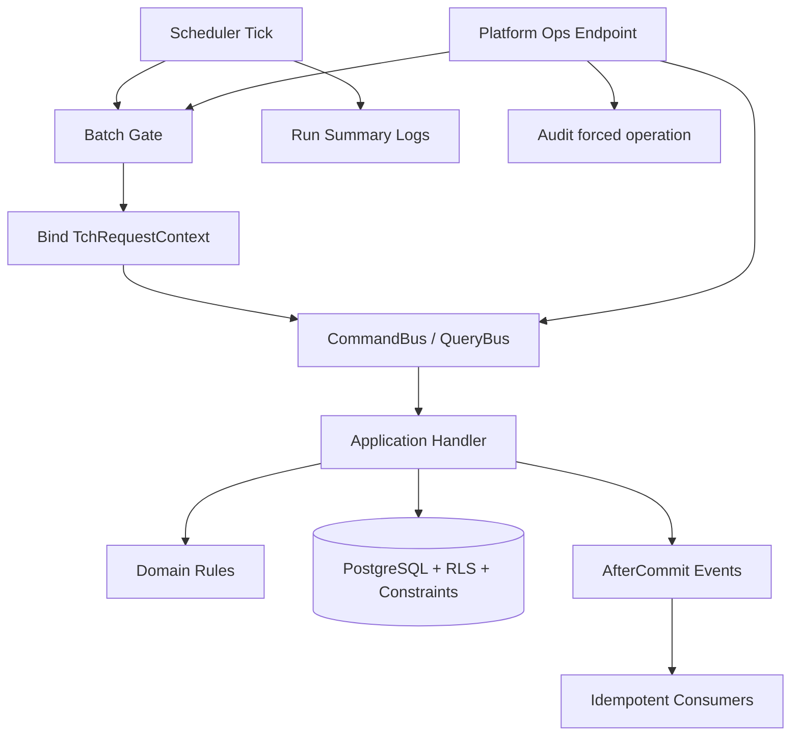
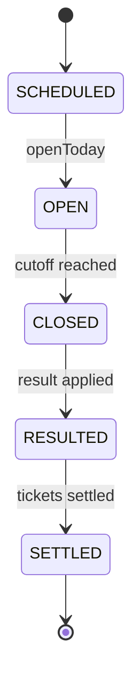

# Tchalanet — Batch & Scheduler Reference

> Status: NORMATIVE  
> Scope: scheduled jobs, Spring Batch, draw lifecycle, processing pipeline, ops forced flows, context binding  
> Owner: Backend / Ops / Architecture

## 1. Objectif

Les batchs et schedulers Tchalanet doivent être :

```text
- prédictibles
- idempotents
- observables
- tenant-safe
- retry-safe
- auditables quand forcés
- minces côté scheduler
```

Règle fondamentale :

```text
Un scheduler orchestre.
Un batch découpe/traite.
Un handler porte la logique métier.
La base garantit l’idempotence et les contraintes.
```

## 2. Règles non négociables

```text
1. Scheduler thin.
2. Pas de logique métier critique dans scheduler.
3. Batch appelle CommandBus / QueryBus ou steps dédiés.
4. Context binding explicite pour batch/scheduler.
5. Aucun scheduler ne dépend d’un ThreadLocal HTTP.
6. Chaque job est idempotent ou protégé par une contrainte unique.
7. Les forced ops exigent permission + reason + audit.
8. Les gates doivent permettre pause/reprise.
9. Les erreurs sont loggées avec résumé exploitable.
10. Les retries ne doivent jamais doubler argent/tickets/payouts.
```

## 3. Architecture générale



## 4. Context binding

HTTP context ne traverse jamais :

```text
scheduler
batch
async
retry
new thread
event replay
```

Chaque job doit créer explicitement :

```text
TENANT context
ou
PLATFORM context
```

Exemples :

```text
Generate tenant draws => TENANT context par tenant
Fetch global results => PLATFORM context ou no tenant selon policy
Apply results to tenant draws => TENANT context
Settle tickets => TENANT context
Forced ops => actor + tenant/platform context audité
```

## 5. Scheduler thin pattern

Un scheduler peut faire :

```text
- lire config active flags
- vérifier gate
- calculer fenêtre temporelle
- binder contexte
- appeler command/query/batch launcher
- logguer summary
```

Un scheduler ne doit pas faire :

```text
- calcul financier
- settlement
- payout
- mutation directe repository
- SQL métier direct
- bypass permission/RLS/idempotency
```

Template :

```java
@Scheduled(cron = "${tch.draw.scheduler.processing.cron}")
public void tick() {
  if (!props.active()) return;
  if (!gate.isOpen("draw.processing")) return;

  var summary = new DrawProcessingSummary();
  try {
    commandBus.execute(new RunDrawProcessingTickCommand(now));
  } catch (Exception e) {
    log.error("draw.processing failed", e);
    summary.failed(e);
  } finally {
    log.info("draw.processing summary={}", summary);
  }
}
```

## 6. Draw lifecycle reference



### Generate

Responsabilité : générer les prochains draws.

Idempotence :

```text
unique(tenant_id, draw_channel_id, draw_date)
```

Scheduler :

```text
- loop active tenants
- bind tenant context
- execute GenerateDrawsForRangeCommand
```

### Open Today

Eligibility :

```text
draw.status = SCHEDULED
draw.draw_date = channel-local date(now)
channel-local time(now) >= sales_open_time
draw.cutoff_at > now
draw.locked = false
```

### Close

Eligibility :

```text
draw.status = OPEN
draw.cutoff_at <= now
draw.locked = false
```

### Fetch

Global result fetch :

```text
- result-slot driven
- no tenant draw mutation
- upsert global draw_result
- provider/slot timezone explicit
```

### Apply

Tenant-scoped attach result :

```text
- attach existing global draw_result to tenant draw
- never fetch provider result here
- never overwrite existing draw_result_id except explicit correction flow
```

### Settle

Tenant-scoped settlement :

```text
- draw.status = RESULTED
- tickets unsettled
- idempotent settlement
- no double payout
```

## 7. Gates

Canonical gates :

```text
draw.generate
draw.open_today
draw.processing
draw.close
drawresult.fetch
drawresult.apply
sales.settle
offline.sync
notification.dispatch
communication.dispatch
```

Gate behavior :

```text
closed gate => scheduler no-op + summary log
open gate => proceed
forced ops may bypass timing, not invariants
```

## 8. Forced ops

Forced operations are dangerous and must require :

```text
- platform/tenant admin permission
- force=true
- non-blank reason
- audit
- actor identity
- request id
```

Force may bypass :

```text
- scheduler timing window
- retry interval
- gate if explicitly allowed
```

Force must not bypass :

```text
- authentication
- authorization
- tenant isolation/RLS
- valid state transitions
- idempotency
- settlement invariants
- payout invariants
```

## 9. Idempotence patterns

Use one or more :

```text
unique constraints
processed_event table
idempotency_record
state guarded update
upsert
business idempotency key
```

Examples :

```text
Generate draw => unique(tenant_id, draw_channel_id, draw_date)
Fetch result => unique(provider, slot, draw_date)
Apply result => update only where draw_result_id is null
Settle ticket => update only where settlement_status = PENDING
Projector => processed_event(handler_key,event_id)
```

## 10. Retry policy

Retry-safe means :

```text
Running the same job twice must not create duplicate business effects.
```

If job fails halfway :

```text
- committed items remain valid
- next run resumes safely
- no duplicate payout/ticket/settlement
- summary indicates partial failure
```

## 11. Timezone policy for batch

```text
Use Clock for now.
Use tenant zone for tenant calendar windows.
Use provider/slot zone for provider result windows.
Never use JVM default timezone.
Convert ZonedDateTime to Instant before persistence.
```

Examples :

```text
open today per tenant/channel => channel/tenant local date
fetch result slot => result_slot timezone
reporting window => tenant timezone
```

## 12. Observability

Every scheduler run must log summary :

```text
job_key
run_id
started_at
finished_at
duration_ms
gate_status
items_scanned
items_processed
items_skipped
items_failed
tenants_processed
errors_count
```

Sensitive forced ops must audit :

```text
actor
permission
reason
force=true
entity/scope
time window
target tenant
result
```

## 13. Error policy

Schedulers :

```text
- catch and log top-level error
- do not crash app loop
- count failures
- continue independent safe steps if allowed
```

Handlers :

```text
- throw business errors normally
- no swallowing invariants
- let transaction rollback
```

Consumers :

```text
- idempotent
- log failure
- retry/replay safe
```

## 14. Batch package placement

```text
core.<domain>.internal.infra.scheduler
core.<domain>.internal.infra.batch
features.<slice> only for orchestration views, not critical batch logic
platform.<capability>.internal.scheduler for platform jobs
```

Examples :

```text
core.draw.internal.infra.scheduler.DrawLifecycleScheduler
core.drawresult.internal.infra.scheduler.DrawProcessingScheduler
core.sales.internal.infra.batch.SettleTicketsJob
platform.communication.internal.scheduler.DispatchCommunicationScheduler
```

## 15. Ops endpoint placement

```text
/platform/ops/**
```

Access :

```text
SUPER_ADMIN or explicit platform ops permission
```

Tenant-scoped forced operation may take target tenant via controlled override, not regular tenant body trust.

## 16. Testing batch/scheduler

Required tests :

```text
- scheduler no-op when disabled
- scheduler no-op when gate closed
- scheduler binds correct context
- generate is idempotent
- open today respects cutoff/timezone
- close respects cutoff
- fetch does not mutate tenant draw
- apply does not overwrite existing result
- settle does not double settle
- forced ops require reason
- forced ops audited
- retry after partial failure safe
```

## 17. PR checklist batch/scheduler

- [ ] Scheduler thin.
- [ ] Business logic in handler/step/domain.
- [ ] Context explicit.
- [ ] Gate respected.
- [ ] Idempotence guaranteed.
- [ ] Retry safe.
- [ ] Timezone explicit.
- [ ] Summary logs.
- [ ] Forced ops permission + reason + audit.
- [ ] Tests for disabled/gate/duplicate/concurrency.
