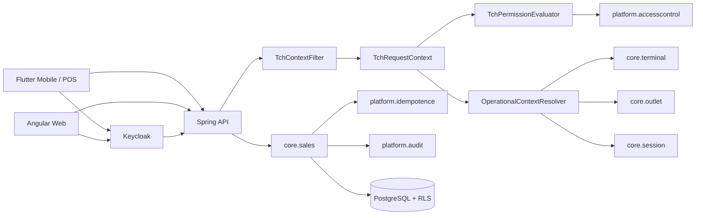
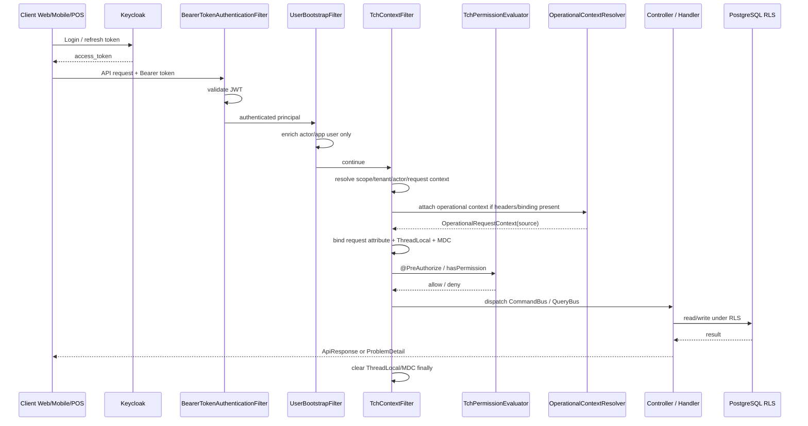
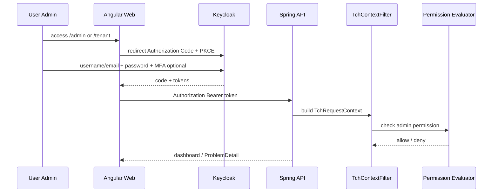
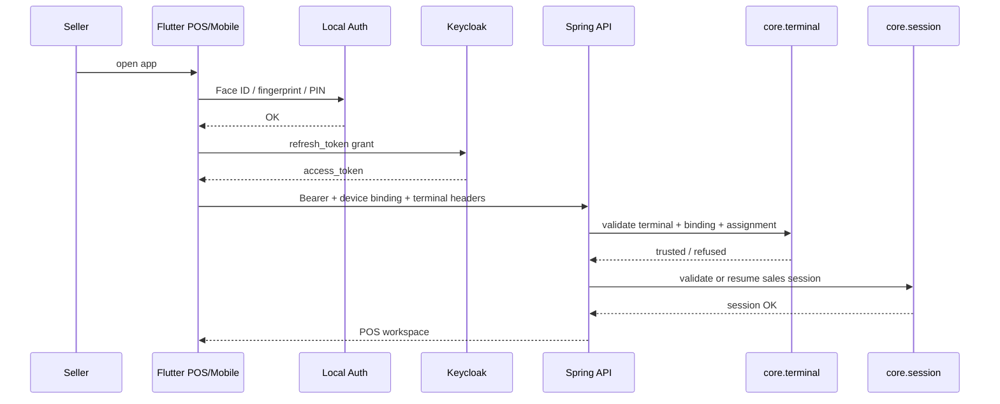
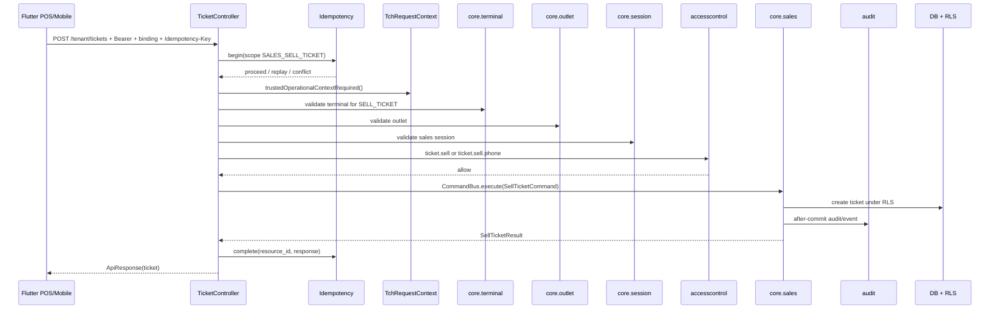

# Tchalanet — Security Reference

> Status: NORMATIVE  
> Scope: Web, Mobile/POS, Backend security, transaction security, terminal trust, permissions, audit  
> Owner: Architecture / Security / Backend

## 1. Positionnement sécurité

Tchalanet n’est pas seulement une application de vente. C’est une plateforme de transactions multi-tenant qui permet la vente depuis :

```text
- Web admin
- Mobile vendeur
- POS physique
- Terminal virtuel téléphone
- Offline contrôlé plus tard
```

Le différenciateur produit est fort :

```text
Vendre depuis un téléphone ou un POS,
sans perdre le contrôle transactionnel.
```

La posture de sécurité officielle :

```text
Tchalanet ne sécurise pas seulement les comptes.
Tchalanet sécurise le contexte de vente.
```

## 2. Règle fondamentale

Aucune transaction sensible ne peut reposer uniquement sur le fait qu’un utilisateur est connecté.

Une transaction sensible exige :

```text
1. Identité valide
2. Tenant valide
3. Permission valide
4. Terminal valide
5. Device/virtual binding valide
6. Outlet valide
7. Sales session valide
8. Operational context trusted
9. Idempotency key si write critique
10. Audit fonctionnel
11. RLS en dernier rempart DB
```

Actions sensibles minimales :

```text
sell ticket
cancel / void ticket
payout pay / approve / reject
offline grant
offline sync
terminal activation / revocation
admin override
forced ops
```

## 3. Composants de sécurité



## 4. Responsabilités

### Keycloak

Keycloak porte l’identité :

```text
- login username / email / phone
- password
- MFA si activé
- access token
- refresh token
- clients web/mobile/pos
```

Keycloak ne décide pas :

```text
- quel terminal peut vendre
- quelle session est ouverte
- quel outlet est valide
- si une vente passe les règles métier
```

### Angular Web

Angular gère l’expérience web :

```text
- redirection login Keycloak
- récupération token
- guards UI
- affichage des écrans admin/dashboard
```

Angular peut cacher un bouton, mais ne doit jamais être l’autorité d’autorisation.

### Flutter Mobile/POS

Flutter gère l’expérience mobile/POS :

```text
- login initial via Keycloak
- stockage sécurisé du refresh token
- Face ID / empreinte / PIN local
- terminal binding local
- headers opérationnels
- retry réseau
```

Flutter ne décide jamais qu’une vente est autorisée.

### Spring Backend

Spring est l’autorité métier :

```text
- validation JWT
- TchRequestContext
- permissions
- terminal binding
- outlet/session validation
- idempotence
- RLS
- audit
- transaction domain
```

## 5. Pipeline HTTP officiel



## 6. Contextes

### Global request context

`TchRequestContext` contient :

```text
tenant
actor/user
roles
scope
locale
timezone
request id
correlation id
idempotency key if present
```

Règle :

```text
Le tenant vient du contexte, jamais du body client.
```

### Operational context

```java
public record OperationalRequestContext(
    TerminalId terminalId,
    OutletId outletId,
    SalesSessionId salesSessionId,
    OperationalContextSource source
) {}
```

Sources trusted :

```text
SERVER_BOOTSTRAP
SIGNED_DEVICE_BINDING
ADMIN_SELECTION
```

Sources untrusted :

```text
CLIENT_CLAIM
NONE
```

Règle officielle :

```text
Global context is validated early.
Operational context is attached early.
Operational context is validated late, per action.
```

## 7. Login Web



Web admin n’a pas de terminal par défaut :

```text
OperationalContextSource = NONE
```

Exception : admin POS mode explicite, source `ADMIN_SELECTION`, audité.

## 8. Login Mobile/POS



Face ID / empreinte :

```text
Ne remplace pas Keycloak.
Déverrouille localement le refresh token.
```

Si refresh token absent/expiré :

```text
Reconnecter via Keycloak.
```

## 9. POS physique

### Activation

```mermaid
activityDiagram-v2
  start
  :Admin crée terminal PHYSICAL_POS;
  :Admin assigne terminal à user + outlet;
  :App POS saisit code / scanne QR;
  :Backend vérifie challenge;
  if (Challenge valide ?) then (oui)
    :Créer SIGNED_DEVICE_BINDING;
    :Terminal ACTIVE;
    :Audit activation;
  else (non)
    :Refuser activation;
    :Audit failure si pertinent;
  endif
  stop
```

### Usage

Le POS envoie :

```http
Authorization: Bearer <access_token>
X-Device-Binding: <signed-binding-token>
X-Terminal-Id: <terminal-id>
X-Outlet-Id: <outlet-id>
X-Sales-Session-Id: <session-id>
X-Request-Id: <uuid>
Idempotency-Key: <uuid>
```

Backend vérifie :

```text
terminal exists
terminal tenant matches RLS/context
terminal status ACTIVE
terminal assigned to user
binding active and valid
outlet active
session open
session terminal/outlet/user match
permission ticket.sell
idempotency valid
```

## 10. Terminal virtuel téléphone

### Activation

```mermaid
activityDiagram-v2
  start
  :Tenant has PHONE_SALES_ENABLED?;
  if (Eligible ?) then (oui)
    :Admin crée VIRTUAL_PHONE terminal;
    :Admin assigne au vendeur;
    :Activation code admin / email OTP / SMS OTP optionnel;
    if (Code valide ?) then (oui)
      :Créer virtual binding;
      :Terminal ACTIVE;
      :Audit activation;
    else (non)
      :Refuser activation;
    endif
  else (non)
    :Refuser option téléphone;
  endif
  stop
```

OTP SMS ne doit pas être utilisé à chaque login. Il sert à :

```text
première activation
changement device
reset sécurité
suspicion fraude
action admin sensible
```

## 11. Transaction de vente sécurisée



## 12. Permissions minimales

```text
ticket.sell
ticket.sell.phone
ticket.cancel
payout.pay
payout.approve
payout.reject
offline.grant
offline.sync
terminal.create
terminal.assign
terminal.activate
terminal.lock
terminal.revoke
session.open
session.close
admin.pos_mode
platform.ops.force
```

Règle :

```text
Controllers declare requirements.
Permission evaluator decides.
No manual if role/permission logic in controller.
```

## 13. Audit obligatoire

À auditer :

```text
login risk events if available
terminal create/assign/activate/revoke/lock
binding create/revoke
virtual phone activation
admin POS mode selection
session open/close
sell ticket
cancel/void ticket
payout actions
offline grant/sync
permission changes
tenant config changes
super admin override
forced ops
```

Audit minimum :

```text
tenant_id
actor_user_id
action
entity_type
entity_id
terminal_id if applicable
outlet_id if applicable
sales_session_id if applicable
request_id
source IP / user agent where useful
result success/failure
reason/details
occurred_at Instant
```

## 14. Refresh token policy

Recommandation MVP :

```text
Access token: 5-10 minutes
Mobile/POS refresh/session idle: 8-24h
Mobile/POS session max: 7-14 days
Admin session max: stricter, MFA recommended/required
```

Règle :

```text
Face ID/PIN => unlock local secure storage
refresh token => obtain access token from Keycloak
access token => call Spring
Spring => validate business security
```

## 15. Abuse cases à bloquer

```text
- user connecté mais aucun terminal trusted
- terminalId inventé dans header
- terminal assigné à un autre user
- terminal d’un autre tenant
- terminal LOCKED/REVOKED
- outlet closed/suspended
- session fermée
- session user/outlet/terminal mismatch
- permission absente
- idempotency key absente
- idempotency payload mismatch
- client tenant_id dans body
- admin POS mode non audité
- refresh token OK mais terminal révoqué
```

## 16. Checklist PR sécurité

- [ ] Aucun endpoint sensible sans `@PreAuthorize` / `@Secured`.
- [ ] Aucun `if role` manuel dans controller.
- [ ] Controller thin.
- [ ] Tenant vient du contexte.
- [ ] Action sensible appelle `trustedOperationalContextRequired()` ou équivalent.
- [ ] Terminal/outlet/session validés côté backend.
- [ ] Idempotency key obligatoire sur vente.
- [ ] Audit sur write sensible.
- [ ] Erreurs en `ProblemDetail`.
- [ ] RLS actif et testé.
- [ ] Tests abuse cases présents.
