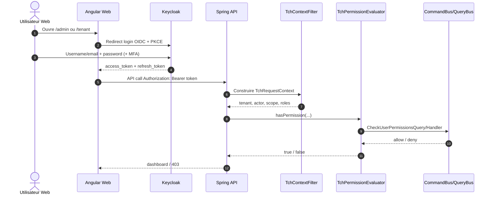
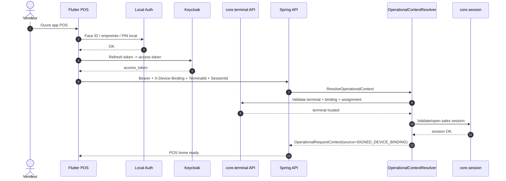
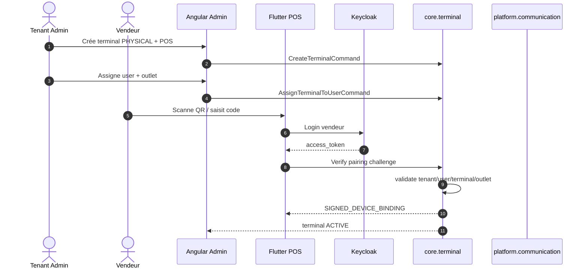
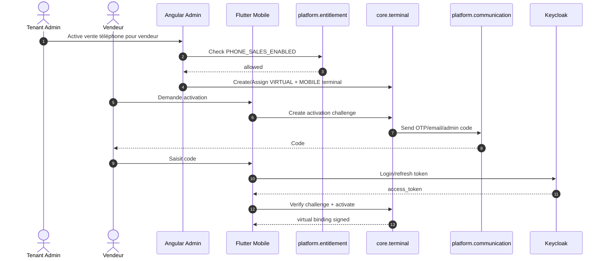
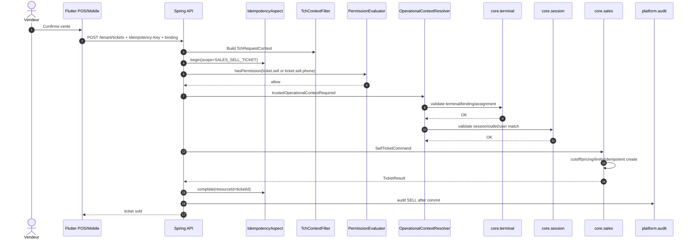
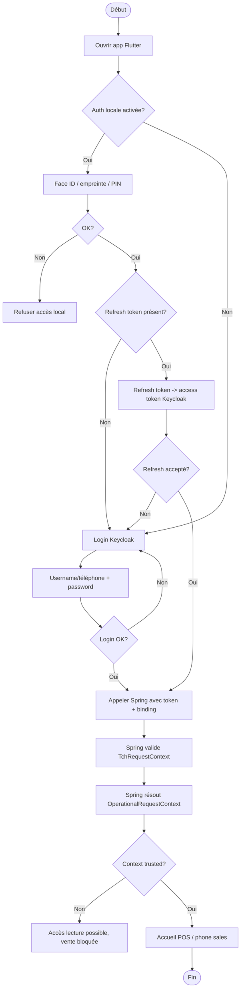
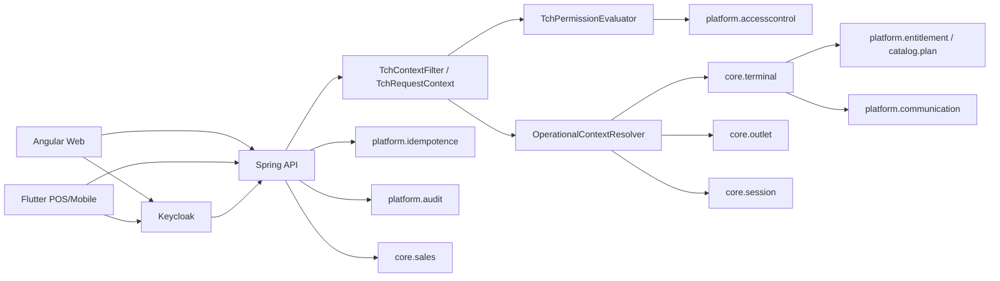

# Diagrammes Mermaid — Login Web/Mobile/POS et sécurité transactionnelle

## 1. Login Web Angular / Admin

## 2. Login Flutter POS avec device binding

## 3. Activation POS physique

## 4. Activation terminal virtuel téléphone

## 5. Vente ticket sécurisée

## 6. Activité — ouverture app mobile/POS

## 7. Composants backend

