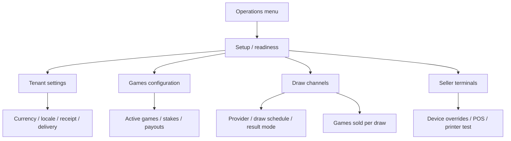

# Design

## Context

Context packs:

- `../../openspec/context/10-non-negotiables.md`
- `tchalanet-web/openspec/context/90-web-rules.md`

Near-code references:

- `tchalanet-web/AGENTS.md`
- `tchalanet-web/docs/conventions/feature-playbook.md`
- `tchalanet-web/apps/admin-portal/src/app/features/setup/pages/complete-config/`
- `tchalanet-web/apps/admin-portal/src/app/features/games-pricing/`
- `tchalanet-web/apps/admin-portal/src/app/features/draw-channels/`
- `tchalanet-web/apps/admin-portal/src/app/features/setup/pages/settings/`

## Information Architecture

The admin configuration model should stay split by ownership:



Setup does not become a mega-form. It shows readiness and routes the admin to the owning page.

## Setup Page Sketch

```text
Configuration initiale
-------------------------------------------------------------------------------
[Progress: 4/5]   Tenant presque prêt à vendre

Essentiel pour vendre
┌────────────────────────┐ ┌────────────────────────┐
│ Identité & adresse     │ │ Paramètres tenant      │
│ READY                  │ │ READY / MISSING        │
│ [Modifier]             │ │ [Configurer]           │
└────────────────────────┘ └────────────────────────┘
┌────────────────────────┐ ┌────────────────────────┐
│ Jeux et gains          │ │ Tirages disponibles    │
│ MISSING                │ │ PARTIAL                │
│ [Configurer jeux]      │ │ [Configurer tirages]   │
└────────────────────────┘ └────────────────────────┘
┌────────────────────────┐
│ Tirages générés        │
│ READY                  │
│ [Voir tirages]         │
└────────────────────────┘

Configuration opérationnelle optionnelle
Ces éléments n'empêchent pas la vente, mais améliorent l'exploitation.

┌────────────────────────┐ ┌────────────────────────┐
│ POS et impression      │ │ Limites de vente       │
│ OPERATIONAL / UNKNOWN  │ │ OPTIONAL               │
│ 58mm, PDF, auto-print  │ │ Risque / contrôle      │
│ [Configurer reçus]     │ │ [Configurer limites]   │
└────────────────────────┘ └────────────────────────┘
┌────────────────────────┐ ┌────────────────────────┐
│ Maryaj Gratis          │ │ Commission             │
│ OPTIONAL               │ │ OPTIONAL               │
│ [Configurer promo]     │ │ [Configurer]           │
└────────────────────────┘ └────────────────────────┘
```

Notes:

- POS / printing is operational, not required.
- Settings remains required only for global sale settings already required by backend readiness.
- Optional cards must never increase `blockingSteps` or reduce `canCreateSellerTerminal`.

## Games Configuration Sketch

```text
Jeux
-------------------------------------------------------------------------------
[Search] [Tout] [A configurer] [Vendable]              [Voir disponibilité par tirage]

┌─────────────────────────────────────────────────────────────────────────────┐
│ Bòlèt                                                        VENDABLE        │
│ Visible POS: Oui     Mises: 1 - 5,000 HTG     Gains: configurés             │
│ Canaux prêts: 12/14   Manquants: 2                                      >   │
│ [Configurer mises et gains] [Disponibilité par tirage]                      │
└─────────────────────────────────────────────────────────────────────────────┘

┌─────────────────────────────────────────────────────────────────────────────┐
│ Maryaj                                                       PARTIEL         │
│ Visible POS: Oui     Mises: OK             Maryaj Gratis: actif             │
│ Canaux prêts: 8/14    Manquants: 6                                      >   │
│ [Configurer mises et gains] [Maryaj Gratis] [Disponibilité par tirage]       │
└─────────────────────────────────────────────────────────────────────────────┘

Dialog: Configurer jeu
┌────────────────────────────────────────────────────────┐
│ Bòlèt                                                  │
│                                                        │
│ 1. Vendre ce jeu                                      │
│    [Actif] [Visible dans POS] [Ordre d'affichage]      │
│                                                        │
│ 2. Mises                                              │
│    Min par ligne   Max par ligne   Horaires optionnels │
│                                                        │
│ 3. Gains                                              │
│    Type de paiement / variantes / aperçu              │
│    "Mise 10 HTG -> gain possible X HTG"                │
│                                                        │
│ 4. Options avancées                                   │
│    Codes techniques, règles rares, diagnostics         │
│                                                        │
│ [Annuler]                                  [Enregistrer]│
└────────────────────────────────────────────────────────┘
```

## Draw Channels Sketch

```text
Tirages disponibles
-------------------------------------------------------------------------------
[Provider] [Statut] [Mode résultat]                         [Matrice jeux x tirages]

┌─────────────────────────────────────────────────────────────────────────────┐
│ Florida Lottery                                          VENDABLE            │
│ Résultats: automatique        Tirages générés: 7 prochains                  │
│                                                                             │
│ ┌─────────────────────────────────────────────────────────────────────────┐ │
│ │ Florida · Aswè                  Vente activée     Jeux: 5/5 prêts        │ │
│ │ Heure: 20:30     Coupure: 10 min avant                                  │ │
│ │ [Configurer jeux vendus] [Voir tirages générés] [Modifier]              │ │
│ └─────────────────────────────────────────────────────────────────────────┘ │
│                                                                             │
│ ┌─────────────────────────────────────────────────────────────────────────┐ │
│ │ Florida · Midi                  Incomplet          Jeux: 3/5 prêts       │ │
│ │ Manque: mises pour Loto 4, Loto 5                                      │ │
│ │ [Compléter configuration] [Modifier]                                    │ │
│ └─────────────────────────────────────────────────────────────────────────┘ │
└─────────────────────────────────────────────────────────────────────────────┘
```

Labels:

- "Provider" becomes "Fournisseur" in UI copy.
- "Channel" becomes "Tirage" or "Tirage disponible" depending on context.
- `AUTO` becomes "Résultats automatiques".
- `MANUAL` becomes "Saisie manuelle des résultats".
- `UNCONFIGURED` becomes "Résultats non configurés".

## Design Decisions

- Keep optional/operational config visible, but visually separated from required setup.
- Keep game and draw-channel pages dense and operational, not marketing-like.
- Prefer chips/status badges over explanatory paragraphs.
- Use existing console components: `tch-admin-page-shell`, `tch-admin-section-card`,
  `tch-async-view`, `TchStatusBadge`, `TchSectionError`, `TchActionButton`.
- Use i18n for every user-visible string.
- Preserve provider/draw display names from backend. Do not translate names such as `Texas` or
  `Georgia`; only translate UI labels around them.

## Open Questions

- Do we need a backend field that summarizes "generated draws coverage" per draw channel, or can the
  web page derive it from existing generated draw and matrix views?
- Should POS / printing readiness be `UNKNOWN` when no print config exists, or `READY` when tenant
  defaults exist even if no terminal has an override?
- Should game payout preview be HTG-only by default, or use tenant default currency from settings?

