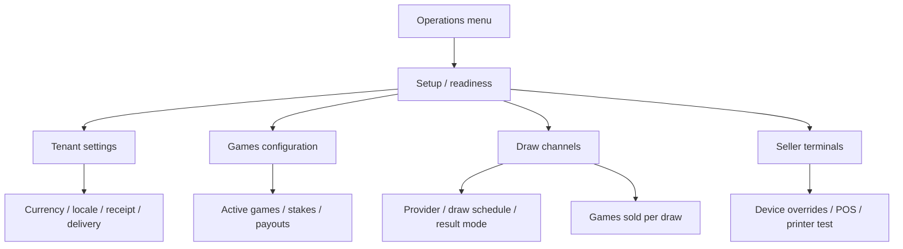

# Design

## Context

Context packs:

- `../../openspec/context/10-non-negotiables.md`
- `tchalanet-web/openspec/context/90-web-rules.md`

Near-code references:

- `tchalanet-web/AGENTS.md`
- `tchalanet-web/docs/conventions/feature-playbook.md`
- `tchalanet-web/apps/admin-portal/src/app/features/setup/pages/complete-config/`
- `tchalanet-web/apps/admin-portal/src/app/features/games-pricing/`
- `tchalanet-web/apps/admin-portal/src/app/features/draw-channels/`
- `tchalanet-web/apps/admin-portal/src/app/features/setup/pages/settings/`

## Information Architecture

The admin configuration model should stay split by ownership:



Setup does not become a mega-form. It shows readiness and routes the admin to the owning page.

## Corrective Destination Map

One problem should lead to one destination:

| Problem | Destination |
| --- | --- |
| No games enabled | Games |
| Game unavailable on a draw | Game availability / draw configuration |
| No upcoming draws | Draw schedule |
| Printing not configured | Tenant settings / Printing |
| Terminal-specific printer issue | Seller terminal |
| Maryaj Gratis incomplete | Maryaj Gratis |

## Setup Page Sketch

```text
Configuration initiale
-------------------------------------------------------------------------------
[Progress: 4/5]   Not ready to sell · 1 blocking item

Required to sell
┌────────────────────────┐ ┌────────────────────────┐
│ Identité & adresse     │ │ Paramètres tenant      │
│ READY                  │ │ READY / MISSING        │
│ [Modifier]             │ │ [Configurer]           │
└────────────────────────┘ └────────────────────────┘
┌────────────────────────┐ ┌────────────────────────┐
│ Jeux et gains          │ │ Tirages disponibles    │
│ MISSING                │ │ PARTIAL                │
│ [Configurer jeux]      │ │ [Configurer tirages]   │
└────────────────────────┘ └────────────────────────┘
┌────────────────────────┐
│ Tirages générés        │
│ READY                  │
│ [Voir tirages]         │
└────────────────────────┘

Operational setup
These items do not block selling, but they improve daily operation.

┌────────────────────────┐ ┌────────────────────────┐
│ POS et impression      │ │ Limites de vente       │
│ Recommended            │ │ Not configured         │
│ 58mm, PDF, auto-print  │ │ Risque / contrôle      │
│ [Configurer reçus]     │ │ [Configurer limites]   │
└────────────────────────┘ └────────────────────────┘
┌────────────────────────┐ ┌────────────────────────┐
│ Maryaj Gratis          │ │ Commission             │
│ OPTIONAL               │ │ OPTIONAL               │
│ [Configurer promo]     │ │ [Configurer]           │
└────────────────────────┘ └────────────────────────┘
```

Notes:

- POS / printing is operational, not required.
- POS / printing status vocabulary is limited to Configured, Not configured, Recommended, and Not enabled.
- Settings remains required only for global sale settings already required by backend readiness.
- Optional cards must never increase `blockingSteps` or reduce `canCreateSellerTerminal`.
- Every setup problem gets one primary corrective action.

## Games Configuration Sketch

```text
Jeux
-------------------------------------------------------------------------------
[Search] [Tout] [A configurer] [Vendable]              [Voir disponibilité par tirage]

┌─────────────────────────────────────────────────────────────────────────────┐
│ Bòlèt                                                        Ready           │
│ Activation: Active     Visible on POS: Yes                                  │
│ Stake limits: 1 - 5,000 HTG       Pricing / payout: Configured              │
│ Available on: 12 draws              Needs attention: 2 draws             >   │
│ [Configure stakes and payout] [Review availability]                         │
└─────────────────────────────────────────────────────────────────────────────┘

┌─────────────────────────────────────────────────────────────────────────────┐
│ Maryaj                                                       Needs attention │
│ Activation: Active     Visible on POS: Yes                                  │
│ Stake limits: OK        Pricing / payout: Configured                        │
│ Maryaj Gratis: Needs attention       Available on: 8 draws              >   │
│ [Configure stakes and payout] [Configure Maryaj Gratis] [Review availability]│
└─────────────────────────────────────────────────────────────────────────────┘

Dialog: Configurer jeu
┌────────────────────────────────────────────────────────┐
│ Bòlèt                                                  │
│                                                        │
│ 1. Vendre ce jeu                                      │
│    [Actif] [Visible dans POS] [Ordre d'affichage]      │
│                                                        │
│ 2. Mises                                              │
│    Min par ligne   Max par ligne   Horaires optionnels │
│                                                        │
│ 3. Gains                                              │
│    Type de paiement / variantes / aperçu              │
│    "Mise 10 HTG -> gain possible X HTG"                │
│                                                        │
│ 4. Options avancées                                   │
│    Codes techniques, règles rares, diagnostics         │
│                                                        │
│ [Annuler]                                  [Enregistrer]│
└────────────────────────────────────────────────────────┘
```

The game page should not require admins to infer availability from technical mappings. Availability
by draw is a first-class summary and action.

## Draw Channels Sketch

```text
Draw channels
-------------------------------------------------------------------------------
[Result source] [Sale status] [Result mode]                  [Game availability]

┌─────────────────────────────────────────────────────────────────────────────┐
│ Florida Lottery                                          Ready               │
│ Result source: Automatic results        Upcoming draws: 7                   │
│                                                                             │
│ ┌─────────────────────────────────────────────────────────────────────────┐ │
│ │ Florida · Aswè                  Ready to sell     5 available games      │ │
│ │ Draw time: 20:30     Sales close: 10 min before    7 upcoming draws      │ │
│ │ [Configure game availability] [Review schedule] [Edit]                  │ │
│ └─────────────────────────────────────────────────────────────────────────┘ │
│                                                                             │
│ ┌─────────────────────────────────────────────────────────────────────────┐ │
│ │ Florida · Midi                  Needs attention   0 available games      │ │
│ │ Upcoming draws exist, but no games can be sold on this draw.            │ │
│ │ [Configure game availability] [Edit]                                    │ │
│ └─────────────────────────────────────────────────────────────────────────┘ │
│                                                                             │
│ ┌─────────────────────────────────────────────────────────────────────────┐ │
│ │ New York · Evening               Needs attention   0 upcoming draws      │ │
│ │ Games are configured, but no upcoming draws were generated.             │ │
│ │ [Review schedule] [Edit]                                               │ │
│ └─────────────────────────────────────────────────────────────────────────┘ │
└─────────────────────────────────────────────────────────────────────────────┘
```

Labels:

- "Provider" becomes "Result source" or "Fournisseur" depending on local copy.
- "Channel" becomes "Tirage" or "Tirage disponible" depending on context.
- `AUTO` becomes "Résultats automatiques".
- `MANUAL` becomes "Saisie manuelle des résultats".
- `UNCONFIGURED` becomes "Résultats non configurés".

Sale readiness and result-source mode are separate:

| Primary sale status | Meaning |
| --- | --- |
| Ready | The draw/channel can sell at least one game and has useful upcoming coverage. |
| Needs attention | The draw/channel is enabled but missing sale coverage, upcoming draws, or required configuration. |
| Disabled | The draw/channel is intentionally unavailable for sale. |

Secondary attributes:

- Automatic / Manual result source.
- Number of available games.
- Number of upcoming/generated draws.

Manual does not imply incomplete. Automatic does not imply ready.

## Seller Terminal Sketch

```text
Seller terminal · POS-006
-------------------------------------------------------------------------------

Printing
┌─────────────────────────────────────────────────────────────────────────────┐
│ Printer                                                                     │
│ Sunmi integrated printer                                                    │
│ Source: Tenant default                                                      │
│ [Override for this terminal]                                                │
└─────────────────────────────────────────────────────────────────────────────┘

┌─────────────────────────────────────────────────────────────────────────────┐
│ Paper size                                                                  │
│ 80 mm                                                                       │
│ Override for this terminal                                                  │
│ [Use tenant default]                                                        │
└─────────────────────────────────────────────────────────────────────────────┘

[Test print]
```

Terminal-specific options stay on seller terminals: Sunmi integrated printer, generic ESC/POS, PDF,
58 mm, 80 mm, A4, auto-print, Bluetooth printer, and test print.

## Web State and API Integration

- API calls stay in feature stores/services, not presentational components.
- Feature-local signal state represents loading, loaded, empty, error, and needs-attention states.
- No global sales-configuration store is introduced.
- `ApiResponse<T>` is consumed through API clients; components receive unwrapped business view data.

## Backend Follow-Up Rule

Implementation starts assuming no backend behavior change. If the UI cannot derive required
presentation reliably, add read-only BFF/read-model fields only:

- use `QueryBus.ask(...)` or stable public APIs for multi-domain aggregation;
- do not access repositories or persistence adapters from `features/*`;
- keep typed IDs outside persistence;
- keep query handlers read-only and side-effect free.

## Design Decisions

- Keep optional/operational config visible, but visually separated from required setup.
- Keep game and draw-channel pages dense and operational, not marketing-like.
- Prefer chips/status badges over explanatory paragraphs.
- Use existing console components: `tch-admin-page-shell`, `tch-admin-section-card`,
  `tch-async-view`, `TchStatusBadge`, `TchSectionError`, `TchActionButton`.
- Use i18n for every user-visible string.
- Preserve provider/draw display names from backend. Do not translate names such as `Texas` or
  `Georgia`; only translate UI labels around them.
- Hide implementation terms from primary copy: provider client, source config, result slot,
  tenant-game mapping, generated entity, BFF.
- Core configuration tasks must work at 360 dp without horizontal scrolling.

## Open Questions

- Do we need a backend field that summarizes "generated draws coverage" per draw channel, or can the
  web page derive it from existing generated draw and matrix views?
- Should POS / printing readiness be `UNKNOWN` when no print config exists, or `READY` when tenant
  defaults exist even if no terminal has an override?
- Should game payout preview be HTG-only by default, or use tenant default currency from settings?
